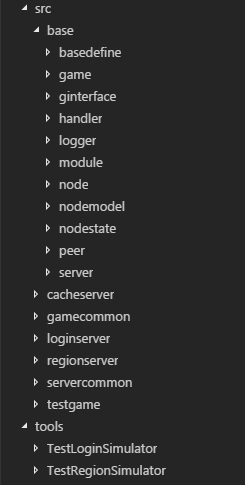

# GolangGameServerGroup
  
A group of game servers written in golang with websocket connections.

## Directory
The base/ directory contains packages about the infrastructure of the group of servers.
* base/ginterface provides the contracts for decoupling the relationships.
* base/logger provides log function.
* base/server corresponds to 1 server.
* base/peer corresponds to 1 connection.
* base/handler handles the request from peer server or client.
* base/module contains some modules cooperated with the server.
* base/game corresponds to 1 game.
* base/node corresponds to 1 instance with model and state control.
* base/nodemodel provides the model of the node.
* base/nodestate provides the states of the node.

The servercommon/ directory contains common operations for servers.  
The gamercommon/ directory contains common operations for games.

## Server group
Now I implement 3 servers in a hierarchical structure.
* The cache server is the root/master server. It coordinates whole subservers.
* The login server is a subserver which is responsible for the login of clients.
* The region server is a subserver which is responsible for the gaming of clients.

The project is under slow development, and I am a newbie about golang. I use this project to practice some design principles of golang. So this project is no proof of work.

## Execution
Execution steps:  
 - `> go run src\cacheserver\server.go`
 - `> go run src\loginserver\server.go`
 - `> go run src\regionserver\server.go`  
or use the prebuild executable files:  
 - `> GolangGameServerGroup\src\cacheserver\server.exe`
 - `> GolangGameServerGroup\src\loginserver\server.exe`
 - `> GolangGameServerGroup\src\regionserver\server.exe`

## Test tool
Test tools:
* tools\TestLoginSimulator provides the simulated login functions for the client.  
* tools\TestRegionSimulator provides the simulated gaming functions for the client.  
I use it to connect and send packets to the server.  
Since it used the local file "command.json" to load the packet json string.  
You must turn on the access-file option of the browser, ex. change the target to  
`"C:\Program Files (x86)\Google\Chrome\Application\chrome.exe --allow-file-access-from-files"`.

